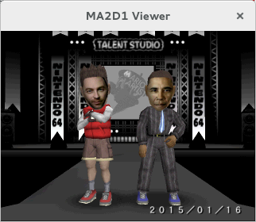

#leotools
2015 jkbenaim

Work with 64DD disk images and the files contained therein.

- [leoimginfo](#leoimginfo): Show information about a 64DD disk image, and extract MFS contents (if they exist).
- [ma2d1view](#ma2d1view): View MA2D1 files. These are pictures saved by games in the Mario Artist series.
- [mathumbview](#mathumbview): View the thumbnail for various Mario Artist files. This is the icon for the file that would be shown in the file browser.
- [psppmview](#psppmview): View PSPPM files. These are animations.

## <a name="leoimginfo"></a>leoimginfo
Show information about a 64DD disk image, and extract MFS contents (if they exist).
### Example run
```console
> leoimginfo NUD-DMTJ-JPN.bin 
SYSTEM AREA
  Disk type     : 0 (retail)
  IPL load address : 80100000
  IPL load size : 43
  ROM end lba   : 1415
  RAM start lba : 1418
  RAM end lba   : 1965
DISK ID
  Initial code  : DMTJ
  Game version  : 0
  Disk number   : 0
  RAM use       : yes
  disk use      : 0
  timestamp     : 2000-02-07 15:39:06
  company code  : 01
  free area     : 4e4d412d4558
SHA1 of ROM area: 22B8E9D3F4E95255AC0FDDCEF4C1BDC073DCE660
MFS (RAM)
  ram start off : 1942a40
  present       : yes (0)
  attr          : 00 (---)
  type          : 0 (match)
  volume name   : MarioArtist
  format date   : 2000-01-12 18:53:12
  renewal count : 29
  destination   : Japan
  checksum      : BB50B310
  max files     : 899

     dir:       .
     dir:       ./jrra♪
     dir:       ./★▲●
     dir:       ./にんてんプロ
     dir:       ./マウス企画
     dir:       ./マイク芸能
     dir:       ./６４ＤＤ劇場
     dir:       ./ＶＣミュージック
     dir:       ./マル福撮影所
     dir:       ./ＧＢテレビ
     dir:       ./★  みる？
 1569864:       ./★  みる？/社長からのごあいさつ .TSBGL
  226832:       ./★▲●/豪  マサル.TSTLT
   38309:       ./★▲●/ムービーの写真.MA2D1
   51116:       ./jrra♪/記念写真　02人.MA2D1
  217040:       ./jrra♪/Obama.TSTLT
  215088:       ./jrra♪/Jimbo.TSTLT
 1569864:       ./jrra♪/ＳＰＥＥＤ.TSANM
```

## <a name="ma2d1view"></a>ma2d1view
View MA2D1 files. These are pictures saved by games in the Mario Artist series.
### Example run
```console
> ma2d1view samples/ma2d1-compressed.MA2D1 
Format: NCMP, dimensions 320x240, 49948 bytes
Press Q to quit.
```



## <a name="mathumbview"></a>mathumbview
View the thumbnail for various Mario Artist files. This is the icon for the file that would be shown in the file browser.

Note that the thumbnails are only 24x24 pixels, so the window is quite small.
### Example run
```console
> mathumbview samples/ma2d1-compressed.MA2D1
Press Q to quit.
```


## Building

Just run ```make ```.

## License

sha1.c and sha1.h are both in the public domain. Other files are GPLv3.